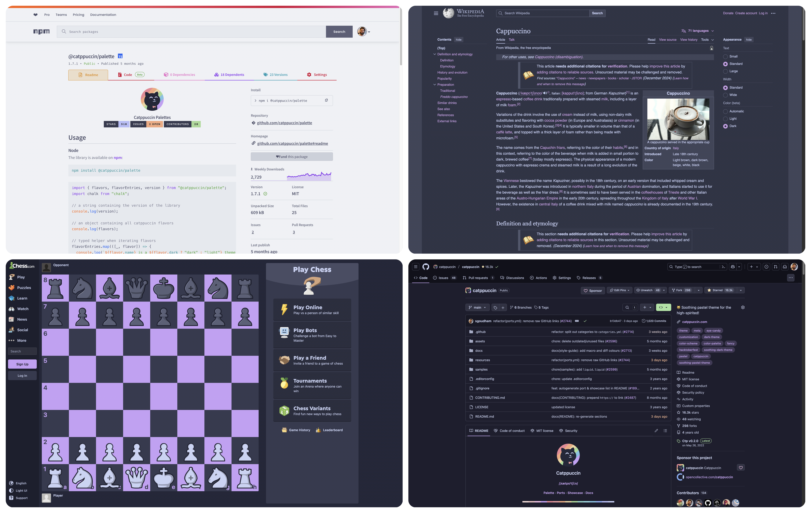

<h3 align="center">
   
  
  Catppuccin Userstyles
  
</h3>

	
  
	
  

A curated collection of soothing pastel themes for your favorite websites and web applications.

Visit <a href="https://userstyles.catppuccin.com">userstyles.catppuccin.com</a> to get started.

&nbsp;

Copyright &copy; 2021-present <a href="https://github.com/catppuccin" target="_blank">Catppuccin Org</a>
