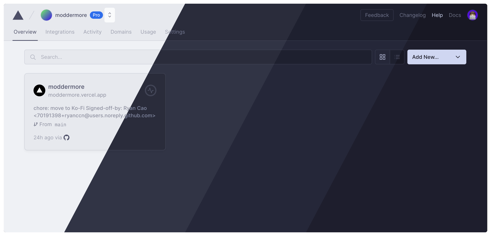
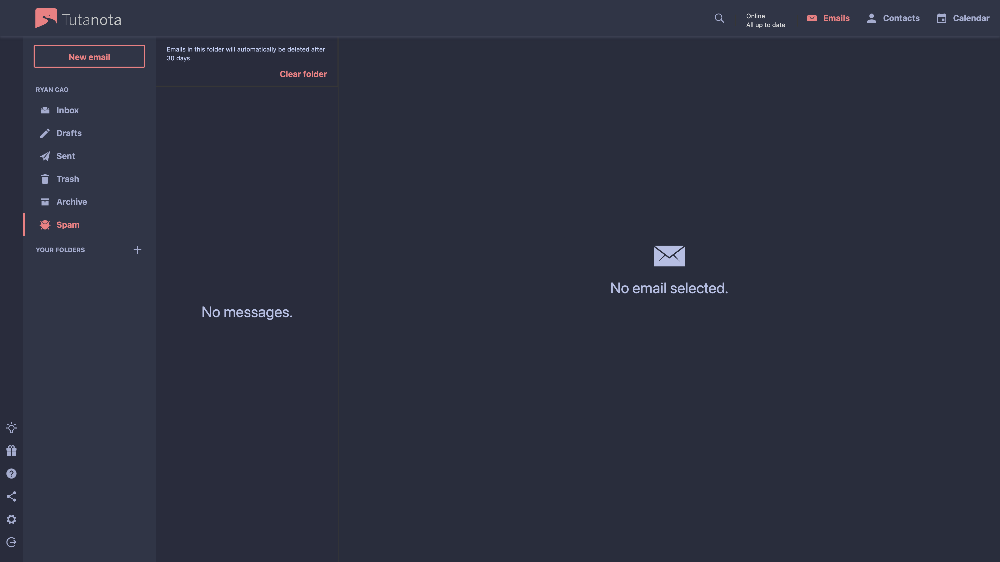
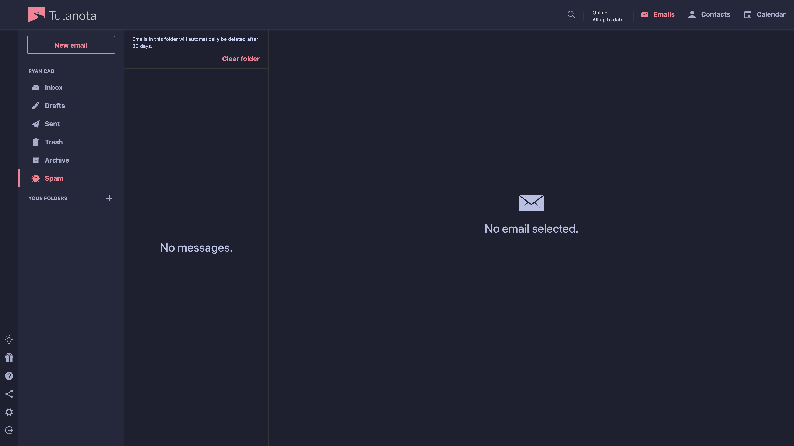
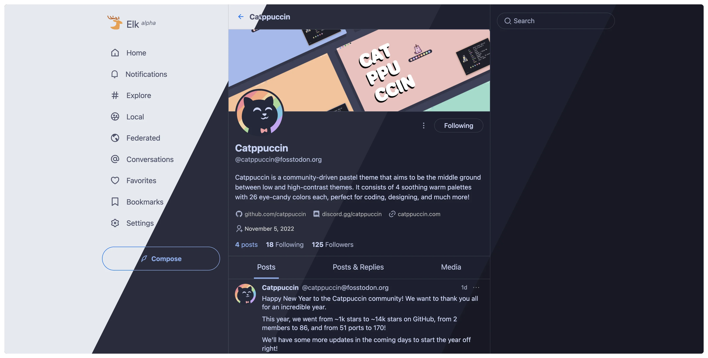
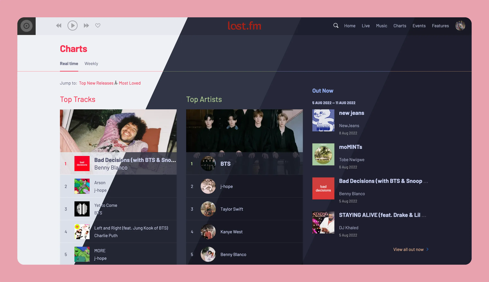

<h3 align="center">
	 
	
	Catppuccin Userstyles
	
</h3>

<h6 align="center">
  <a href="#install">Install</a>
  ·
  <a href="#-userstyles">Userstyles</a>
</h6>

&nbsp;

## Install
To install these userstyles:
1. Install [Stylus](https://github.com/openstyles/stylus)
    - [Firefox](https://addons.mozilla.org/en-GB/firefox/addon/styl-us/)/[Chrome](https://chrome.google.com/webstore/detail/stylus/clngdbkpkpeebahjckkjfobafhncgmne) extension.
2. Enable CSP Patching from Stylus Settings > Advanced.
3. Install the theme:
    - from this url:
        - `https://github.com/catppuccin/userstyles/raw/main/styles/<name>/catppuccin.user.css`
        - Replacing `<name>` with the name of the userstyle.
    - OR, click on the stylus badge in the dropdowns for the style below
4. Enjoy!

&nbsp;

## 🖌 Userstyles
<!-- AUTOGEN:USERSTYLES START -->
<!-- the following section is auto-generated, do not edit -->
&nbsp;

<!-- -->
### 💭 Development tools

#### <a href="styles/vercel">Vercel</a> | <a href="https://vercel.com">(Website)</a>

    &nbsp;

  

	
	

#### Previews

🌻 Latte

🪴 Frappé

🌺 Macchiato

🌿 Mocha

#### 💝 Thanks to

- [Ryan Cao](https://github.com/ryanccn)
     

&nbsp;

<!-- -->
### 🔎 Search Engines

#### <a href="styles/brave-search">Brave Search</a> | <a href="https://search.brave.com">(Website)</a>

    &nbsp;

  

	
	

#### Previews

🌻 Latte

🪴 Frappé

🌺 Macchiato

🌿 Mocha

#### Usage
Set theme to dark or light in Brave Search settings, the automatic setting will not work

#### 💝 Thanks to

- [ndsboy](https://github.com/ndsboy)
     

#### <a href="styles/nixos-search">NixOS Search</a> | <a href="https://search.nixos.org">(Website)</a>

    &nbsp;

  

	
	

#### Previews

🌻 Latte

🪴 Frappé

🌺 Macchiato

🌿 Mocha

#### 💝 Thanks to

- [alaidriel](https://github.com/alaidriel)
     

#### <a href="styles/searxng">SearXNG</a> | <a href="https://github.com/searxng/searxng">(Website)</a>

    &nbsp;

  

	
	

#### Previews

🌻 Latte

🪴 Frappé

🌺 Macchiato

🌿 Mocha

#### 💝 Thanks to

- [Sekki](https://github.com/Sekki21956)
- [winston](https://github.com/nekowinston)
- [Andreas Grafen](https://github.com/andreasgrafen)
- [Ryan Cao](https://github.com/ryanccn)
     

&nbsp;

<!-- -->
### 💬 Messaging

#### <a href="styles/cinny">Cinny</a> | <a href="https://github.com/cinnyapo/cinny">(Website)</a>

    &nbsp;

  

	
	

#### Previews

🌻 Latte

🪴 Frappé

🌺 Macchiato

🌿 Mocha

#### 💝 Thanks to

- [jan Sena](https://github.com/jn-sena)
     

&nbsp;

<!-- -->
### 🗂️ Productivity

#### <a href="styles/codeberg">Codeberg</a> | <a href="https://codeberg.org">(Website)</a>

    &nbsp;

  

	
	

#### Previews

🌻 Latte

🪴 Frappé

🌺 Macchiato

🌿 Mocha

#### 🙋 FAQ
- Q: How do I change the accent color?  
	A: Changing `--color-primary` to any other color should change the accent color in most places

#### 💝 Thanks to

- [justTOBBI](https://github.com/justTOBBI)
     

#### <a href="styles/deepl">DeepL</a> | <a href="https://deepl.com">(Website)</a>

    &nbsp;

  

	
	

#### Previews

🌻 Latte

🪴 Frappé

🌺 Macchiato

🌿 Mocha

#### 💝 Thanks to

- [Ren](https://github.com/watatomo)
     

#### <a href="styles/github">GitHub</a> | <a href="https://github.com">(Website)</a>

    &nbsp;

  

	
	

#### Previews

🌻 Latte

🪴 Frappé

🌺 Macchiato

🌿 Mocha

#### 💝 Thanks to

- [Pocco81](https://github.com/Pocco81)
- [Umbreon](https://github.com/GlowingUmbreon)
- [Andreas Grafen](https://github.com/andreasgrafen)
     

#### <a href="styles/ichi.moe">ichi.moe</a> | <a href="https://ichi.moe">(Website)</a>

    &nbsp;

  

	
	

#### Previews

🌻 Latte

🪴 Frappé

🌺 Macchiato

🌿 Mocha

#### 💝 Thanks to

- [Ren](https://github.com/watatomo)
     

#### <a href="styles/proton">Proton</a> | <a href="https://proton.me/">(Website)</a>

    &nbsp;

  

	
	

#### Previews

🌻 Latte

🪴 Frappé

🌺 Macchiato

🌿 Mocha

#### Usage
Open Proton Mail and click the settings in the top right, then set the base theme to `Proton` if you are using the Latte flavor, otherwise set it to `Carbon`

#### 💝 Thanks to

- [soya_daizu](https://github.com/soya-daizu)
     

#### <a href="styles/tutanota">Tutanota</a> | <a href="https://tutanota.com/">(Website)</a>

    &nbsp;

  

	
	

#### Previews

🌻 Latte

🪴 Frappé

🌺 Macchiato

🌿 Mocha

#### Usage
> **Note**  
> Set Tutanota's built-in theme to either **light** if you're using Latte or **dark** if you're using the others.

#### 💝 Thanks to

- [Ryan Cao](https://github.com/ryanccn)
     

#### <a href="styles/wikiwand">WikiWand</a> | <a href="https://www.wikiwand.com">(Website)</a>

    &nbsp;

  

	
	

#### Previews

🌻 Latte

🪴 Frappé

🌺 Macchiato

🌿 Mocha

#### 💝 Thanks to

- [Tnixc](https://github.com/tnixc)
- [rubyowo](https://github.com/rubyowo)
     

&nbsp;

<!-- -->
### ✨ Social

#### <a href="styles/elk">Elk</a> | <a href="https://elk.zone">(Website)</a>

    &nbsp;

  

	
	

#### Previews

🌻 Latte

🪴 Frappé

🌺 Macchiato

🌿 Mocha

#### 💝 Thanks to

- [Ryan Cao](https://github.com/ryanccn)
     

#### <a href="styles/hacker-news">Hacker News</a> | <a href="https://news.ycombinator.com/">(Website)</a>

    &nbsp;

  

	
	

#### Previews

🌻 Latte

🪴 Frappé

🌺 Macchiato

🌿 Mocha

#### 💝 Thanks to

- [Lucas Melin](https://github.com/lucasmelin)
     

#### <a href="styles/invidious">Invidious</a> | <a href="https://invidious.io">(Website)</a>

    &nbsp;

  

	
	

#### Previews

🌻 Latte

🪴 Frappé

🌺 Macchiato

🌿 Mocha

#### 💝 Thanks to

- [Andreas Grafen](https://github.com/andreasgrafen)
     

#### <a href="styles/libreddit">Libreddit</a> | <a href="https://github.com/libreddit/libreddit">(Website)</a>

    &nbsp;

  

	
	

#### Previews

🌻 Latte

🪴 Frappé

🌺 Macchiato

🌿 Mocha

#### 💝 Thanks to

- [Andreas Grafen](https://github.com/andreasgrafen)
     

#### <a href="styles/mastodon">Mastodon</a> | <a href="https://github.com/mastodon/mastodon">(Website)</a>

    &nbsp;

  

	
	

#### Previews

🌻 Latte

🪴 Frappé

🌺 Macchiato

🌿 Mocha

#### Usage
Add urls to `@-moz-document domain("url")` with url being the chosen server

#### 🙋 FAQ
- Q: **The theme does not look the same as the preview?**  
	A: Your Mastodon instance may be using its own custom CSS, which is changing the look of the theme
- Q: **Theme is not working?**  
	A: One solution might be changing the theme from the `preferences > application > theme` to light or dark.

#### 💝 Thanks to

- [Andreas Grafen](https://github.com/andreasgrafen)
- [Isabel](https://github.com/isabelroses)
     

#### <a href="styles/nitter">Nitter</a> | <a href="https://nitter.net">(Website)</a>

    &nbsp;

  

	
	

#### Previews

🌻 Latte

🪴 Frappé

🌺 Macchiato

🌿 Mocha

#### 💝 Thanks to

- [AnubisNekhet](https://github.com/AnubisNekhet)
     

#### <a href="styles/reddit">Reddit</a> | <a href="https://reddit.com">(Website)</a>

    &nbsp;

  

	
	

#### Previews

🌻 Latte

🪴 Frappé

🌺 Macchiato

🌿 Mocha

#### 💝 Thanks to

- [jayylmao](https://github.com/jayylmao)
- [rubyowo](https://github.com/rubyowo)
     

#### <a href="styles/twitch">Twitch</a> | <a href="https://twitch.tv">(Website)</a>

    &nbsp;

  

	
	

#### Previews

🌻 Latte

🪴 Frappé

🌺 Macchiato

🌿 Mocha

#### Usage
> **Note**  
> Set Twitch's built-in theme to either **light** if you're using Latte or **dark** if you're using the others.

#### 💝 Thanks to

- [mustafakhalaf-git](https://github.com/mustafakhalaf-git)
     

#### <a href="styles/youtube">YouTube</a> | <a href="https://youtube.com">(Website)</a>

    &nbsp;

  

	
	

#### Previews

🌻 Latte

🪴 Frappé

🌺 Macchiato

🌿 Mocha

#### Usage
> **Note**  
> Make sure your base YouTube theme is set to **light** mode!

#### 🙋 FAQ
- Q: **What does the 'Enable for black bars' option mean?**  
	A: It is there in-case you have an OLED display. If you have one, you might want to enable this.

#### 💝 Thanks to

- [Isabel](https://github.com/isabelroses)
- [rubyowo](https://github.com/rubyowo)
- [Elkrien](https://github.com/elkrien)
- [artilate](https://github.com/artilate)
     

&nbsp;

<!-- -->
### 🌈 Leisure

#### <a href="styles/anilist">AniList/Anichart</a> | <a href="https://anilist.co">(Website)</a>

    &nbsp;

  

	
	

#### Previews (anilist)

🌻 Latte

🪴 Frappé

🌺 Macchiato

🌿 Mocha

  

#### Previews (anichart)

🌻 Latte

🪴 Frappé

🌺 Macchiato

🌿 Mocha

#### Usage
> **Note**  
> This theme applies to [AniChart](https://anichart.net/) as well, which is an extension of AniList.

#### 💝 Thanks to

- [AnubisNekhet](https://github.com/AnubisNekhet)
     

#### <a href="styles/lastfm">Last.fm</a> | <a href="https://last.fm">(Website)</a>

    &nbsp;

  

	
	

#### Previews

🌻 Latte

🪴 Frappé

🌺 Macchiato

🌿 Mocha

#### 💝 Thanks to

- [AnubisNekhet](https://github.com/AnubisNekhet)
- [Gingeh](https://github.com/Gingeh)
     

&nbsp;

<!-- -->
### 🎮 Games

#### <a href="styles/modrinth">Modrinth</a> | <a href="https://modrinth.com">(Website)</a>

    &nbsp;

  

	
	

#### Previews

🌻 Latte

🪴 Frappé

🌺 Macchiato

🌿 Mocha

#### 💝 Thanks to

- [thismoon](https://github.com/thismoon)
     

<!-- AUTOGEN:USERSTYLES END -->

&nbsp;

### Contributing

TODO

&nbsp;

Copyright &copy; 2021-present <a href="https://github.com/catppuccin" target="_blank">Catppuccin Org</a>
