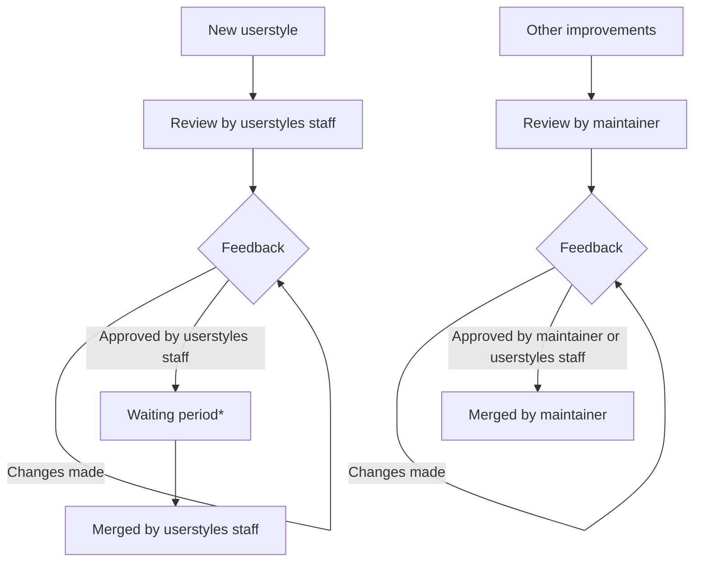

# Contributing!

🎉 First off, thanks for taking the time to contribute! 🎉

## Guidelines

The following is a set of guidelines for contributing to this repository. Use
your best judgment, and feel free to propose changes to this document in a pull
request.

## Types of PRs

It is important to note that there are **two types of PRs** for this repository:

1. **New Userstyles:** Please see [userstyle-creation.md](./userstyle-creation.md).
2. **Other improvements:** These should follow the recommendations below, to help improve the chances of a merged PR.

## Recommendations

### Root Variables

While writing a userstyle, you may have come across [custom properties / CSS variables](https://developer.mozilla.org/en-US/docs/Web/CSS/--*), typically wrapped in a `:root` selector. We refer to these variables as "root variables", and they can be thought of as global variables used all across a website. For Catppuccin userstyles, we prefer that these variables are themed (if they exist) rather than individual elements. As the website hopefully uses these variables themselves, it saves yourself a lot of work in theming and maintaining the userstyle.

### Opinionated Changes

When writing or updating a userstyle, it is important to keep in mind that different users have different preferences. To avoid lengthy discussion over user interface aesthetics, we have a set of rules for what a userstyle may include; importantly, **changes to font or layout (padding, margin, hiding/moving elements) are prohibited.**

### General Recommendations

- Create a [topic branch](https://git-scm.com/book/en/v2/Git-Branching-Branching-Workflows#_topic_branch) on your fork for your specific PR.
- Catppuccin uses the [Conventional Commits](https://www.conventionalcommits.org/en/v1.0.0/)
  standard for creating explicit and meaningful commit messages. This repository
  requires pull request _titles_ to be in the conventional commit format,
  however we do not require it for individual commits within a pull request.
- Update the version in the `==UserStyle==` header of the `catppuccin.user.css`
  file. This is to enable version control of the style.
- If it's your first time contributing to a project then you should look to the
  popular [first-contributions](https://github.com/firstcontributions/first-contributions)
  repository on GitHub. This will give you hands-on experience with the features
  of GitHub required to make a contribution. As always, feel free to join our [Discord](https://discord.com/servers/catppuccin-907385605422448742) to ask
  any questions and clarify your understanding, we are more than happy to help!
- Changes to docs may need to use [marksman](https://github.com/artempyanykh/marksman) to generate the table of contents.

## Pull Request Review Process

\*A waiting period is usually started if a website is particularly complex or for any other reason could not be thoroughly/completely tested. Waiting periods typically last between 1 and 2 days.
