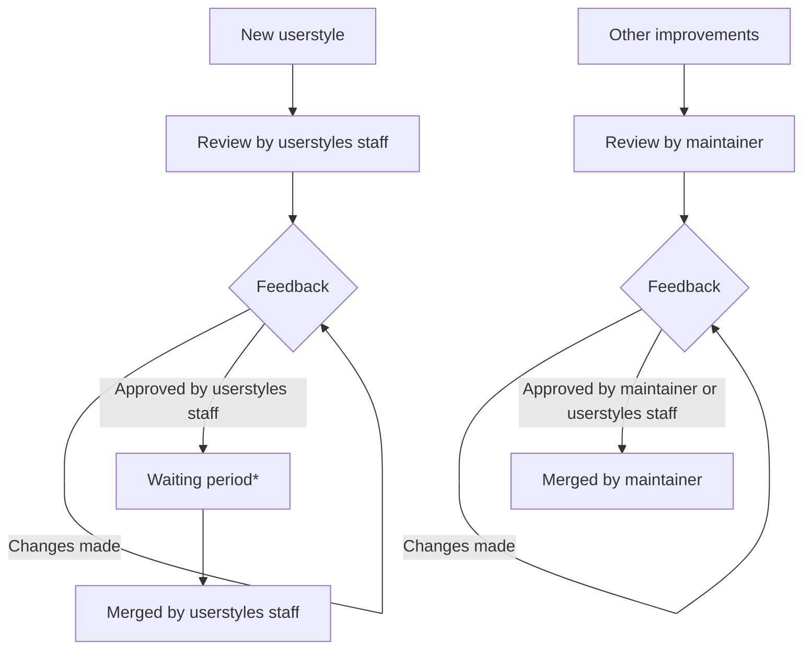

# Contributing!

🎉 First off, thanks for taking the time to contribute! 🎉

## Guidelines

The following is a set of guidelines for contributing to this repository. Use
your best judgment, and feel free to propose changes to this document in a pull
request.

## Types of PRs

It is important to note that there are **two types of PRs** for this repository:

1. **New Userstyles:** Please see
   [userstyle-creation.md](./userstyle-creation.md).
2. **Other improvements:** These should follow the recommendations below, to
   help improve the chances of a merged PR.
## Recommendations

### Root Variables

Whilst writing an userstyle, its likely you have come across something like
`--black: #000;` in the `:root` selector. These are called root variables, and
they are used to store values that can be reused throughout the userstyle. In
userstyles, its important that we prefer using these over theming individual
elements, as it allows for a more consistent and maintainable userstyle.

### Opinionated Changes

When making changes to the userstyle, it is important to remember that different
users would like to have different things. This is why we have a set of rules
that we follow when making changes to the userstyle. This is why we have the
linter to flag any changes that do not follow these rules. These rules include:

- No font changes
- No layout changes
  - Padding, margin, and width changes
  - Hiding elements
  - Changes to the position of elements

### General Recommendations

- Create a
  [topic branch](https://git-scm.com/book/en/v2/Git-Branching-Branching-Workflows#_topic_branch)
  on your fork for your specific PR.
- Catppuccin uses the
  [Conventional Commits](https://www.conventionalcommits.org/en/v1.0.0/)
  standard for creating explicit and meaningful commit messages. This repository
  requires pull request _titles_ to be in the conventional commit format,
  however we do not require it for individual commits within a pull request.
- Update the version in the `==UserStyle==` header of the `catppuccin.user.css`
  file. This is to enable version control of the style.
- If it's your first time contributing to a project then you should look to the
  popular
  [first-contributions](https://github.com/firstcontributions/first-contributions)
  repository on GitHub. This will give you hands-on experience with the features
  of GitHub required to make a contribution. As always, feel free to join our
  [Discord](https://discord.com/servers/catppuccin-907385605422448742) to ask
  any questions and clarify your understanding, we are more than happy to help!

## Pull Request Review Process

*A waiting period is assigned only for styles that could not be tested, this
period is usually 1-2 days.
