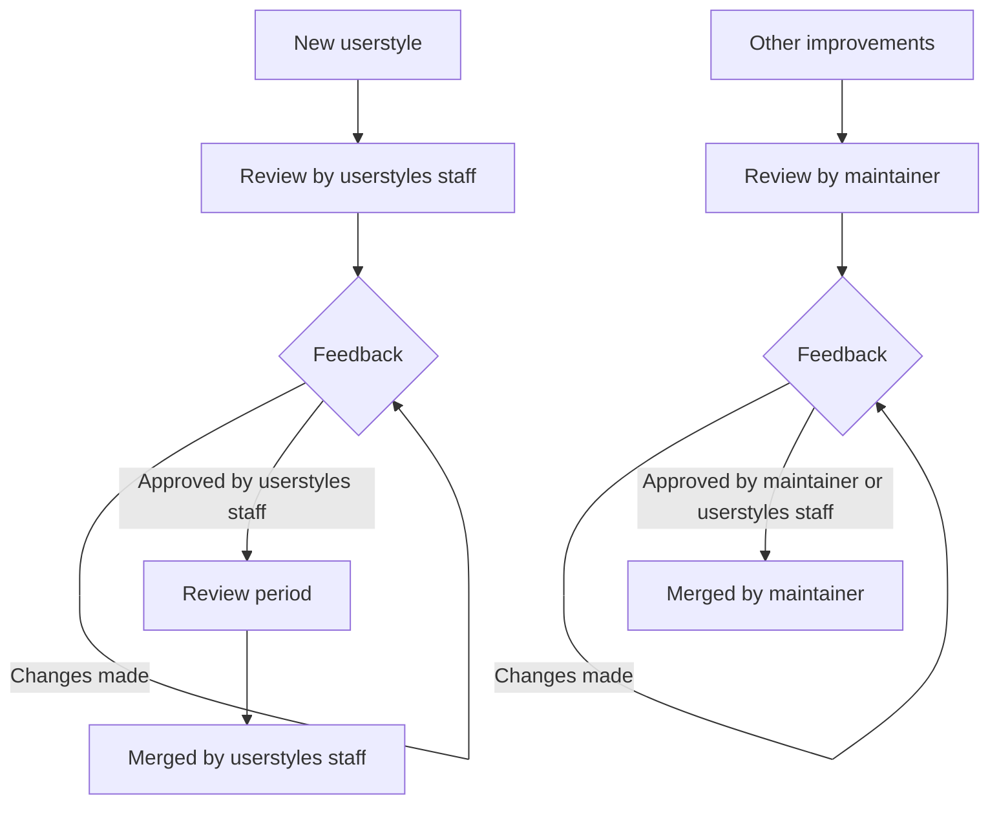

# Contributing

If it is your first time contributing to a project on GitHub, please see the popular [first-contributions](https://github.com/firstcontributions/first-contributions) repository. This will give you hands-on experience with the features of GitHub required to make a contribution. As always, feel free to join our [Discord](https://discord.com/servers/catppuccin-907385605422448742) to ask any questions and clarify your understanding, we are more than happy to help!

## Development environment

This repositories uses [Deno](https://deno.com/) extensively for linting, formatting, and automation. We recommend setting up Deno locally to improve your workflow — see ["Installation" - Deno Docs](https://docs.deno.com/runtime/manual/getting_started/installation). With Deno installed locally, you can run the lint script using `deno task lint` (and `deno task lint:fix` to automatically apply fixes) and the formatting script using `deno fmt`.

When editing a userstyle, we suggest setting up live reloading so your local changes can be automatically reloaded through Stylus. See ["How can I see my changes in real time?"](./tips-and-tricks/see-changes-in-real-time.md).

## Recommendations

### Assessing websites

Some websites are unfortunately not ideal for userstyles. Websites with auto-generated classes - think `aeN WR beA nH oy8Mbf`, `cfb2a888`, etc. - lead to unreadable and unmaintainable userstyles that break quickly and are difficult to update/maintain. Such userstyles, if created, will also take longer to review and merge.

### CSS variables

While writing a userstyle, you may have come across [CSS variables](https://developer.mozilla.org/en-US/docs/Web/CSS/--*) (or "custom properties"). We prefer that these variables are used if present, rather than theming individual elements. As the website typically uses these variables itself, it saves a lot of work in theming and maintaining the userstyle.

### Opinionated changes

When writing or updating a userstyle, it is important to keep in mind that different users have different preferences. To avoid lengthy discussion over user interface aesthetics, we have a set of rules for what a userstyle may include; importantly, **changes to font, layout, padding, margin, display, and in general anything besides color tweaks are prohibited.**

### Pull requests

- Create a [topic branch](https://git-scm.com/book/en/v2/Git-Branching-Branching-Workflows#_topic_branch) on your fork for your specific PR.
- Catppuccin uses the [Conventional Commits](https://www.conventionalcommits.org/en/v1.0.0/) standard for creating explicit and meaningful commit messages. This repository requires pull request _titles_ to be in the conventional commit format, however we do not require it for individual commits within a pull request.
- It's better to have a draft pull request than no pull request at all. Having a draft lets others know that a userstyle is being worked on, and gives the opportunity for people to try it out ahead of time (if they really want it themed!).

### Contribution review process

