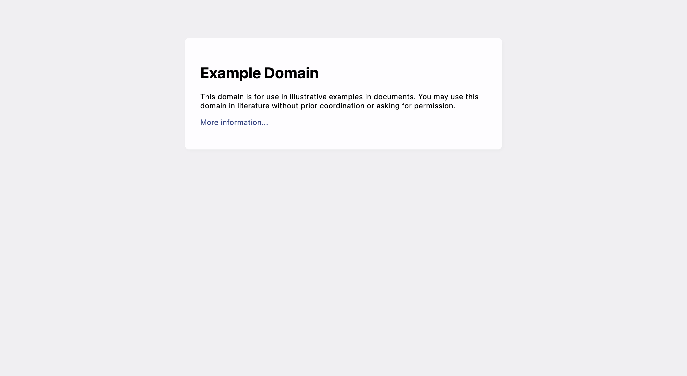
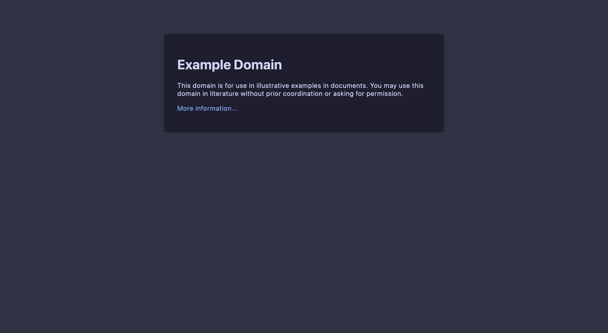

<p align="center">
  <h2 align="center">📖 How to write a userstyle</h2>
</p>

<p align="center">
	Beginner-friendly guide for creating a userstyle!
</p>

&nbsp;

### Table of Contents

<!--toc:start-->

- [Prerequisites](#prerequisites)
- [Usercss Metadata](#usercss-metadata)
- [`@-moz-document`](#-moz-document)
- [Applying the theme](#applying-the-theme)
- [The `#catppuccin` mixin](#the-catppuccin-mixin)
- [Putting it all together](#putting-it-all-together)

<!--toc:end-->

### Prerequisites

- [Stylus](https://github.com/openstyles/stylus) ([Firefox](https://addons.mozilla.org/en-GB/firefox/addon/styl-us/) / [Chrome](https://chrome.google.com/webstore/detail/stylus/clngdbkpkpeebahjckkjfobafhncgmne)
  extension).
- A website to theme!

Assuming you have completed steps 1-4 of [Creating Userstyles](./userstyle-creation.md#creating-userstyles), you should have a new `catppuccin.user.css` file under the `styles/<name-of-website>/` directory. Follow along in that `catppuccin.user.css` file as we write an example userstyle for [example.org](http://example.org/).

### Usercss Metadata

Start by filling out the "metadata block" at the very top of the template. Replace `<port-name>` with the name of the website you are porting, and please ensure it is capitalized when needed. For `example.org`, it looks like this:

```less
/* ==UserStyle==
@name example.org Catppuccin
@namespace github.com/catppuccin/userstyles/styles/example.org
@homepageURL https://github.com/catppuccin/userstyles/tree/main/styles/example.org
@version 0.0.1
@updateURL https://github.com/catppuccin/userstyles/raw/main/styles/example.org/catppuccin.user.css
@supportURL https://github.com/catppuccin/userstyles/issues?q=is%3Aopen+is%3Aissue+label%3Aexample.org
@description Soothing pastel theme for example.org
@author Catppuccin
@license MIT

@preprocessor less
@var select lightFlavor "Light Flavor" ["latte:Latte*", "frappe:Frappé", "macchiato:Macchiato", "mocha:Mocha"]
@var select darkFlavor "Dark Flavor" ["latte:Latte", "frappe:Frappé", "macchiato:Macchiato", "mocha:Mocha*"]
@var select accentColor "Accent" ["rosewater:Rosewater", "flamingo:Flamingo", "pink:Pink", "mauve:Mauve", "red:Red", "maroon:Maroon", "peach:Peach", "yellow:Yellow", "green:Green", "teal:Teal", "blue:Blue", "sapphire:Sapphire*", "sky:Sky", "lavender:Lavender", "subtext0:Gray"]
==/UserStyle== */
```

The rest of the metadata block details the preprocessor and the options of the userstyle. This won't need to be changed. For more information, see ["Usercss Metadata" - Stylus Wiki](https://github.com/openstyles/stylus/wiki/Writing-UserCSS#usercss-metadata).

### `@-moz-document`

To tell Stylus which website(s) to apply this userstyle on, replace `<website-domain>` with the domain of your port. For `example.org`, it looks like this:

```less
@-moz-document domain('example.org') {
```

> [!NOTE]
> While `domain()` works for most cases, you may need to use [`regexp()`](https://github.com/openstyles/stylus/wiki/Writing-styles#regexp) for websites with more complex URLs. For example:
>
> ```less
> @-moz-document regexp('http://example.(com|net|org|edu)/') {
> ```

### Applying the theme

This section of the template is about applying the user's light/dark flavors. Read the comments for this section in the template thoroughly and decide which of the two options works best for your port. `example.org` doesn't have a light/dark mode toggle, so we'll apply it based on the user's preferences.

<!-- prettier-ignore -->
```less
@media (prefers-color-scheme: light) {
  :root {
    #catppuccin(@lightFlavor, @accentColor);
  }
}
@media (prefers-color-scheme: dark) {
  :root {
    #catppuccin(@darkFlavor, @accentColor);
  }
}
```

> [!TIP]
> If `example.org` _did_ use a toggle for changing the theme, we suggest using inspect element to try to observe what changes occur when the toggle is adjusted. Typically websites will have a class or attribute on the root `<html>` element. Some examples from our userstyles include `[theme="dark"]`, `.dark`, `.theme-dark`, etc.

### The `#catppuccin` mixin

We'll refer to this next section of the template as the "`#catppuccin` mixin". You can ignore the first half of this section with all of the `@<color>: @catppuccin[@@lookup][@<color>];` lines and skip to the comment where it says `// Start styling your website here:`. As the comment suggests, you will write the CSS rules for your port here. Here is what it looks like for our `example.org` port:

<!-- prettier-ignore -->
```less
#catppuccin(@lookup, @accent) {
  @rosewater: @catppuccin[@@lookup][@rosewater];
  /* ... */
  @accent-color: @catppuccin[@@lookup][@@accent];

  color-scheme: if(@lookup = latte, light, dark);

  ::selection {
    background-color: fade(@accent-color, 30%);
  }

  input,
  textarea {
    &::placeholder {
      color: @subtext0 !important;
    }
  }

  body {
    background-color: @base;

    & > div {
      color: @text;
      background-color: @surface0;
    }
  }

  a:link,
  a:visited {
    color: @accent-color;
  }

  /* ... */
}
```

### Putting it all together

Combining all of the previous steps, we have a working userstyle!

```less
/* ==UserStyle==
@name example.org Catppuccin
@namespace github.com/catppuccin/userstyles/styles/example.org
@homepageURL https://github.com/catppuccin/userstyles/tree/main/styles/example.org
@version 0.0.1
@updateURL https://github.com/catppuccin/userstyles/raw/main/styles/example.org/catppuccin.user.css
@supportURL https://github.com/catppuccin/userstyles/issues?q=is%3Aopen+is%3Aissue+label%3Aexample.org
@description Soothing pastel theme for example.org
@author Catppuccin
@license MIT

@preprocessor less
@var select lightFlavor "Light Flavor" ["latte:Latte*", "frappe:Frappé", "macchiato:Macchiato", "mocha:Mocha"]
@var select darkFlavor "Dark Flavor" ["latte:Latte", "frappe:Frappé", "macchiato:Macchiato", "mocha:Mocha*"]
@var select accentColor "Accent" ["rosewater:Rosewater", "flamingo:Flamingo", "pink:Pink", "mauve:Mauve", "red:Red", "maroon:Maroon", "peach:Peach", "yellow:Yellow", "green:Green", "teal:Teal", "blue:Blue", "sapphire:Sapphire*", "sky:Sky", "lavender:Lavender", "subtext0:Gray"]
==/UserStyle== */

@-moz-document domain('example.org') {
  @media (prefers-color-scheme: light) {
    :root {
      #catppuccin(@lightFlavor, @accentColor);
    }
  }
  @media (prefers-color-scheme: dark) {
    :root {
      #catppuccin(@darkFlavor, @accentColor);
    }
  }

  #catppuccin(@lookup, @accent) {
    @rosewater: @catppuccin[@@lookup][@rosewater];
    @flamingo: @catppuccin[@@lookup][@flamingo];
    @pink: @catppuccin[@@lookup][@pink];
    @mauve: @catppuccin[@@lookup][@mauve];
    @red: @catppuccin[@@lookup][@red];
    @maroon: @catppuccin[@@lookup][@maroon];
    @peach: @catppuccin[@@lookup][@peach];
    @yellow: @catppuccin[@@lookup][@yellow];
    @green: @catppuccin[@@lookup][@green];
    @teal: @catppuccin[@@lookup][@teal];
    @sky: @catppuccin[@@lookup][@sky];
    @sapphire: @catppuccin[@@lookup][@sapphire];
    @blue: @catppuccin[@@lookup][@blue];
    @lavender: @catppuccin[@@lookup][@lavender];
    @text: @catppuccin[@@lookup][@text];
    @subtext1: @catppuccin[@@lookup][@subtext1];
    @subtext0: @catppuccin[@@lookup][@subtext0];
    @overlay2: @catppuccin[@@lookup][@overlay2];
    @overlay1: @catppuccin[@@lookup][@overlay1];
    @overlay0: @catppuccin[@@lookup][@overlay0];
    @surface2: @catppuccin[@@lookup][@surface2];
    @surface1: @catppuccin[@@lookup][@surface1];
    @surface0: @catppuccin[@@lookup][@surface0];
    @base: @catppuccin[@@lookup][@base];
    @mantle: @catppuccin[@@lookup][@mantle];
    @crust: @catppuccin[@@lookup][@crust];
    @accent-color: @catppuccin[@@lookup][@@accent];

    color-scheme: if(@lookup = latte, light, dark);

    ::selection {
      background-color: fade(@accent-color, 30%);
    }

    input,
    textarea {
      &::placeholder {
        color: @subtext0 !important;
      }
    }

    body {
      background-color: @base;

      & > div {
        color: @text;
        background-color: @surface0;
      }
    }

    a:link,
    a:visited {
      color: @accent-color;
    }
  }
}

/* prettier-ignore */
@catppuccin: {
  @latte:     { @rosewater: #dc8a78; @flamingo: #dd7878; @pink: #ea76cb; @mauve: #8839ef; @red: #d20f39; @maroon: #e64553; @peach: #fe640b; @yellow: #df8e1d; @green: #40a02b; @teal: #179299; @sky: #04a5e5; @sapphire: #209fb5; @blue: #1e66f5; @lavender: #7287fd; @text: #4c4f69; @subtext1: #5c5f77; @subtext0: #6c6f85; @overlay2: #7c7f93; @overlay1: #8c8fa1; @overlay0: #9ca0b0; @surface2: #acb0be; @surface1: #bcc0cc; @surface0: #ccd0da; @base: #eff1f5; @mantle: #e6e9ef; @crust: #dce0e8; };
  @frappe:    { @rosewater: #f2d5cf; @flamingo: #eebebe; @pink: #f4b8e4; @mauve: #ca9ee6; @red: #e78284; @maroon: #ea999c; @peach: #ef9f76; @yellow: #e5c890; @green: #a6d189; @teal: #81c8be; @sky: #99d1db; @sapphire: #85c1dc; @blue: #8caaee; @lavender: #babbf1; @text: #c6d0f5; @subtext1: #b5bfe2; @subtext0: #a5adce; @overlay2: #949cbb; @overlay1: #838ba7; @overlay0: #737994; @surface2: #626880; @surface1: #51576d; @surface0: #414559; @base: #303446; @mantle: #292c3c; @crust: #232634; };
  @macchiato: { @rosewater: #f4dbd6; @flamingo: #f0c6c6; @pink: #f5bde6; @mauve: #c6a0f6; @red: #ed8796; @maroon: #ee99a0; @peach: #f5a97f; @yellow: #eed49f; @green: #a6da95; @teal: #8bd5ca; @sky: #91d7e3; @sapphire: #7dc4e4; @blue: #8aadf4; @lavender: #b7bdf8; @text: #cad3f5; @subtext1: #b8c0e0; @subtext0: #a5adcb; @overlay2: #939ab7; @overlay1: #8087a2; @overlay0: #6e738d; @surface2: #5b6078; @surface1: #494d64; @surface0: #363a4f; @base: #24273a; @mantle: #1e2030; @crust: #181926; };
  @mocha:     { @rosewater: #f5e0dc; @flamingo: #f2cdcd; @pink: #f5c2e7; @mauve: #cba6f7; @red: #f38ba8; @maroon: #eba0ac; @peach: #fab387; @yellow: #f9e2af; @green: #a6e3a1; @teal: #94e2d5; @sky: #89dceb; @sapphire: #74c7ec; @blue: #89b4fa; @lavender: #b4befe; @text: #cdd6f4; @subtext1: #bac2de; @subtext0: #a6adc8; @overlay2: #9399b2; @overlay1: #7f849c; @overlay0: #6c7086; @surface2: #585b70; @surface1: #45475a; @surface0: #313244; @base: #1e1e2e; @mantle: #181825; @crust: #11111b; };
}

// vim:ft=less
```

| Original                                | Themed                                |
| --------------------------------------- | ------------------------------------- |
|  |  |

Complete the rest of the steps in [Creating Userstyles](./userstyle-creation.md#creating-userstyles), and then submit your PR!
