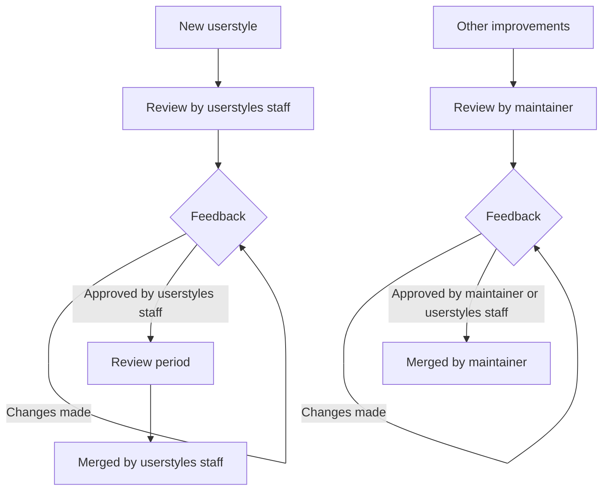

## Making changes

> [!TIP]
> If this is your first time contributing to a project on GitHub, please see the popular [first-contributions](https://github.com/firstcontributions/first-contributions) repository. This will give you hands-on experience with the features of GitHub required to make a contribution. As always, feel free to join our [Discord](https://discord.com/servers/catppuccin-907385605422448742) to ask any questions and clarify your understanding, we are more than happy to help!

### Pull requests

- Create a [topic branch](https://git-scm.com/book/en/v2/Git-Branching-Branching-Workflows#_topic_branch) on your fork for your specific PR.
- Catppuccin uses the [Conventional Commits](https://www.conventionalcommits.org/en/v1.0.0/) standard for creating explicit and meaningful commit messages. This repository requires pull request _titles_ to be in the conventional commit format, however we do not require it for individual commits within a pull request.
- It's better to have a draft pull request than no pull request at all. Having a draft lets others know that a userstyle is being worked on, and gives the opportunity for people to try it out ahead of time (if they really want it themed!).

### Contribution review process

## General

### Versioning

All userstyles are versioned in the UserCSS metadata section at the top of each userstyle, by a line in the format of `@version 2000.01.01`. **This line SHOULD NOT be edited by hand**. We use an automated versioning system that updates the version value (based on [Calendar Versioning](https://calver.org/)) when a change is made to a userstyle, after merging the pull request.

### New userstyle considerations

When considering adopting a new userstyle into the collection, we prioritize long-term maintainability. Some websites are, unfortunately, not ideal for userstyles. Websites with auto-generated classnames — think `aeN WR beA nH oy8Mbf`, `cfb2a888`, and so on — lead to unreadable and unmaintainable userstyles that are difficult to keep functional. **We highly recommend not writing userstyles for these types of websites.** If in doubt, reach out to us via an issue or on Discord first.

On the other hand, some websites are ideally suited for userstyles. For example, websites using CSS custom properties (CSS variables) are great candidates since they are often simpler and more straightforward to theme.

#### CSS variables

[CSS variables](https://developer.mozilla.org/en-US/docs/Web/CSS/--*), or CSS custom properties, can be a great benefit to writing userstyles. We prefer that CSS variables are themed if present, rather than theming individual elements/classes. As the website uses these variables itself (hopefully!), it saves time and effort in theming and maintaining the userstyle.

### Opinionated changes

When writing or updating a userstyle, it is important to keep in mind that different users have different preferences. To avoid lengthy discussion over user interface aesthetics, **changes to font, layout, padding, margin, display, and generally anything besides color tweaks, are prohibited.**

## Development environment

### Editing

To edit and/or create userstyles, [set up live reloading](/contributing/tips-and-tricks/hot-reloading/) so that local changes (edits made from your editor of choice) can be automatically reloaded through Stylus.

### Tasks

This repository uses [Deno](https://deno.com/) for linting, formatting, and automation — see ["Installation" - Deno Docs](https://docs.deno.com/runtime/manual/getting_started/installation) to set it up locally.

#### Linting

Lint all userstyles by running `deno task lint` in the terminal. If any issues are found, run `deno task lint:fix` to automatically apply fixes (*in some cases).

For faster linting, specify the userstyle to check as an argument to the `deno task lint` command. For example, `deno task lint my-userstyle` (or using the relative path from the root directory, `deno task lint styles/my-userstyle`).

> [!WARNING]
> `deno task lint` is not to be confused with Deno's built-in linter, `deno lint`. `deno task lint` is the custom Deno task for linting userstyles (**use this one**), `deno lint` lints only our internal scripts.

#### Formatting

Format changed files with `deno fmt` before opening a pull request.
