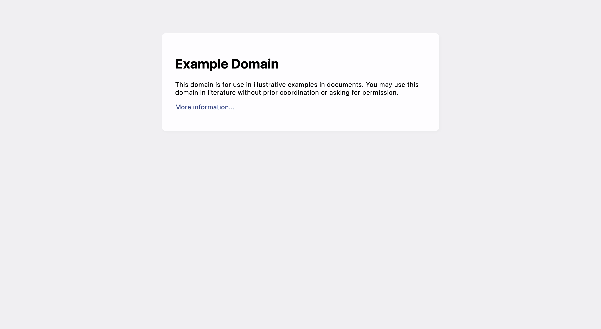
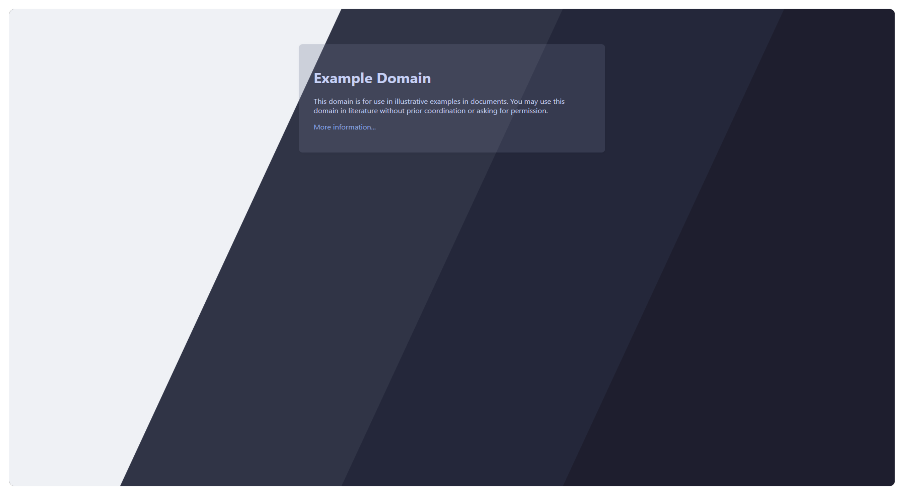

## Prerequisites

- [Stylus](https://github.com/openstyles/stylus) ([Firefox](https://addons.mozilla.org/en-GB/firefox/addon/styl-us/) / [Chrome](https://chrome.google.com/webstore/detail/stylus/clngdbkpkpeebahjckkjfobafhncgmne) extension).
- A website to theme!

Assuming you have completed steps 1-4 of [Creating Userstyles](/contributing/creating-userstyles/), you should have a new `catppuccin.user.less` file under the `styles/<name-of-website>/` directory. Follow along in that `catppuccin.user.less` file as we write an example userstyle for [example.org](http://example.org/).

## Usercss Metadata

Start by filling out the "metadata block" at the very top of the template. Replace `<port-name>` with the name of the website you are porting, and please ensure it is capitalized when needed. For `example.org`, it looks like this:

```less
/* ==UserStyle==
@name example.org Catppuccin
@namespace github.com/catppuccin/userstyles/styles/example.org
@homepageURL https://github.com/catppuccin/userstyles/tree/main/styles/example.org
@version 2000.01.01
@updateURL https://github.com/catppuccin/userstyles/raw/main/styles/example.org/catppuccin.user.less
@supportURL https://github.com/catppuccin/userstyles/issues?q=is%3Aopen+is%3Aissue+label%3Aexample.org
@description Soothing pastel theme for example.org
@author Catppuccin
@license MIT

@preprocessor less
@var select lightFlavor "Light Flavor" ["latte:Latte*", "frappe:Frappé", "macchiato:Macchiato", "mocha:Mocha"]
@var select darkFlavor "Dark Flavor" ["latte:Latte", "frappe:Frappé", "macchiato:Macchiato", "mocha:Mocha*"]
@var select accentColor "Accent" ["rosewater:Rosewater", "flamingo:Flamingo", "pink:Pink", "mauve:Mauve", "red:Red", "maroon:Maroon", "peach:Peach", "yellow:Yellow", "green:Green", "teal:Teal", "blue:Blue", "sapphire:Sapphire*", "sky:Sky", "lavender:Lavender", "subtext0:Gray"]
==/UserStyle== */
```

The rest of the metadata block details the preprocessor and the options of the userstyle. This won't need to be changed. For more information, see ["Usercss Metadata" - Stylus Wiki](https://github.com/openstyles/stylus/wiki/Writing-UserCSS#usercss-metadata).

## `@-moz-document`

To tell Stylus which website(s) to apply this userstyle on, replace `<website-domain>` with the domain of your port. For `example.org`, it looks like this:

```less
@-moz-document domain("example.org") {
```

> [!NOTE]
> While `domain()` works for most cases, you may need to use [`regexp()`](https://github.com/openstyles/stylus/wiki/Writing-styles#regexp) for websites with more complex URLs. For example:
>
> ```less
> @-moz-document regexp("http://example.(com|net|org|edu)/") {
> ```

## Applying the theme

This section of the template is about applying the user's light/dark flavors. Read the comments for this section in the template thoroughly and decide which of the two options works best for your port. `example.org` doesn't have a light/dark mode toggle, so we'll apply it based on the user's preferences.

```less
:root {
  @media (prefers-color-scheme: light) {
    #catppuccin(@lightFlavor);
  }
  @media (prefers-color-scheme: dark) {
    #catppuccin(@darkFlavor);
  }
}
```

> [!TIP]
> If `example.org` _did_ use a toggle for changing the theme, we suggest using inspect element to try to observe what changes occur when the toggle is adjusted. Typically websites will have a class or attribute on the root `<html>` element. Some examples from our userstyles include `[theme="dark"]`, `.dark`, `.theme-dark`, etc.

## The `#catppuccin` mixin

> [!TIP]
> For more on how Less mixins work, see ["Mixins" - lesscss.org](https://lesscss.org/features/#mixins-feature) and ["A Comprehensive Introduction to Less: Mixins" - SitePoint](https://www.sitepoint.com/a-comprehensive-introduction-to-less-mixins/).

We'll refer to this next section of the template as the "`#catppuccin` mixin". The first part contains a series of mixin calls to include the Catppuccin palette and style defaults from the standard library:

```less
#lib.palette();
#lib.defaults();
```

Following that, you will write the CSS rules for your port. Here is what it looks like for our `example.org` port:

```less
#catppuccin(@flavor) {
  #lib.palette();
  #lib.defaults();

  body {
    background-color: @base;

    & > div {
      color: @text;
      background-color: @surface0;
    }
  }

  a:link,
  a:visited {
    color: @accent;
  }

  /* ... */
}
```

## Putting it all together

Combining all of the previous steps, we have a working userstyle!

```less
/* ==UserStyle==
@name example.org Catppuccin
@namespace github.com/catppuccin/userstyles/styles/example.org
@homepageURL https://github.com/catppuccin/userstyles/tree/main/styles/example.org
@version 2000.01.01
@updateURL https://github.com/catppuccin/userstyles/raw/main/styles/example.org/catppuccin.user.less
@supportURL https://github.com/catppuccin/userstyles/issues?q=is%3Aopen+is%3Aissue+label%3Aexample.org
@description Soothing pastel theme for example.org
@author Catppuccin
@license MIT

@preprocessor less
@var select lightFlavor "Light Flavor" ["latte:Latte*", "frappe:Frappé", "macchiato:Macchiato", "mocha:Mocha"]
@var select darkFlavor "Dark Flavor" ["latte:Latte", "frappe:Frappé", "macchiato:Macchiato", "mocha:Mocha*"]
@var select accentColor "Accent" ["rosewater:Rosewater", "flamingo:Flamingo", "pink:Pink", "mauve:Mauve", "red:Red", "maroon:Maroon", "peach:Peach", "yellow:Yellow", "green:Green", "teal:Teal", "blue:Blue", "sapphire:Sapphire*", "sky:Sky", "lavender:Lavender", "subtext0:Gray"]
==/UserStyle== */

@-moz-document domain("example.org") {
  :root {
    @media (prefers-color-scheme: light) {
      #catppuccin(@lightFlavor);
    }
    @media (prefers-color-scheme: dark) {
      #catppuccin(@darkFlavor);
    }
  }

  #catppuccin(@flavor) {
    #lib.palette();
    #lib.defaults();

    body {
      background-color: @base;

      & > div {
        color: @text;
        background-color: @surface0;
      }
    }

    a:link,
    a:visited {
      color: @accent;
    }
  }
}
```

| Original                                                                                     | Themed                                                                                                                                                                                                                           |
| -------------------------------------------------------------------------------------------- | -------------------------------------------------------------------------------------------------------------------------------------------------------------------------------------------------------------------------------- |
|  |  |

Complete the rest of the steps in [Creating Userstyles](/contributing/creating-userstyles/), and then submit your PR!
