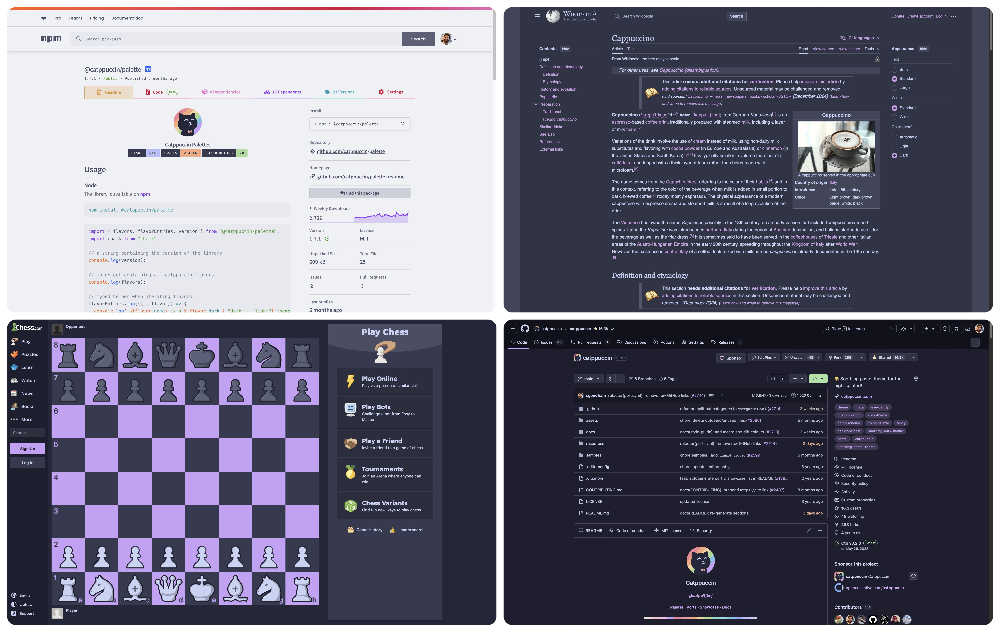

A curated collection of soothing pastel themes for your favorite websites and web applications.

## Getting started

To get started using the catppuccin/userstyles collection, see [Usage](/getting-started/usage/).

To get started contributing to catppuccin/userstyles, see [Contributing](/contributing/) and [Creating Userstyles](/contributing/creating-userstyles/).

## Userstyles

> [!NOTE]
> Userstyles labeled with the "❤️‍🩹" emoji lack maintainers, and may not work as intended. Contributions are still welcome and encouraged!

import AnchorHeading from '@astrojs/starlight/components/AnchorHeading.astro';
import { ports } from "../../../lib/ports";
import { categories, sortedCategories, categoryMap } from "../../../lib/categories";

{sortedCategories.map((cat) => {
  const category = categories[cat];
  return (
    <>
      <AnchorHeading level="3" id={cat}>{category.emoji}{' '}{category.name}</AnchorHeading>
      
{category.description}

      <ul>
        {categoryMap[cat]
          .sort((a, b) => a.name.localeCompare(b.name))
          .map((port) => (
            <li>
              <a href={`https://github.com/catppuccin/userstyles/tree/main/styles/${port.slug}`}>
                {port.currentMaintainers.length > 0 ? '' : '❤️‍🩹 '}
                {port.name}
              </a>
            </li>
          ))}
      </ul>
    </>
  );
})}
