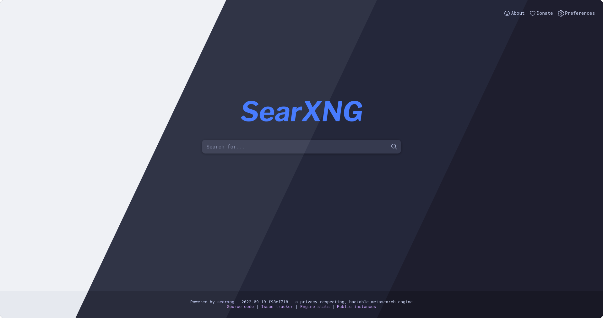

<h3 align="center">
	 
	
	Catppuccin for <a href="https://github.com/searxng/searxng">SearXNG</a>
	
</h3>

	
	
	
  

	

## Usage

#### Stylus
1. Install Stylus [Firefox](https://addons.mozilla.org/en-GB/firefox/addon/styl-us/)/[Chrome](https://chrome.google.com/webstore/detail/stylus/clngdbkpkpeebahjckkjfobafhncgmne) extension.
2. Enable CSP Patching from Stylus Settings > Advanced.
3. [Click here to install.](https://github.com/catppuccin/SearXNG/raw/main/catppuccin.user.css)
4. Enjoy!. 

## 💝 Thanks to

- [Sekki](https://github.com/Sekki21956)
- [Winston](https://github.com/nekowinston)
- [Andreas](https://github.com/andreasgrafen)

&nbsp;

	

	Copyright &copy; 2021-present <a href="https://github.com/catppuccin" target="_blank">Catppuccin Org</a>

	

