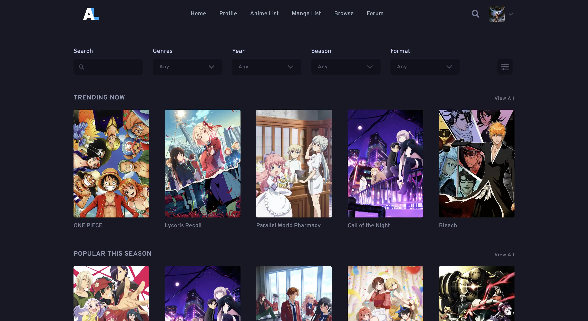

<h3 align="center">
	 
	
	Catppuccin for <a href="https://anilist.co">AniList</a>
	
</h3>

	
	

  

## Previews

🌻 Latte

🪴 Frappé

🌺 Macchiato

🌿 Mocha

## Installation

1. Install Stylus [Firefox](https://addons.mozilla.org/en-GB/firefox/addon/styl-us/)/[Chrome](https://chrome.google.com/webstore/detail/stylus/clngdbkpkpeebahjckkjfobafhncgmne) extension.
<!-- TODO: Remove this from every README and include it at the top -->
2. Enable CSP Patching from Stylus Settings > Advanced.
3. [Click here to install.](catppuccin.user.css?raw=1)

## Usage  
> **Note**  
> This theme applies to [AniChart](https://anichart.net/) as well, which is an extension of AniList.

## 💝 Thanks to

- [AnubisNekhet](https://github.com/AnubisNekhet)

&nbsp;

	

	Copyright &copy; 2021-present <a href="https://github.com/catppuccin" target="_blank">Catppuccin Org</a>

