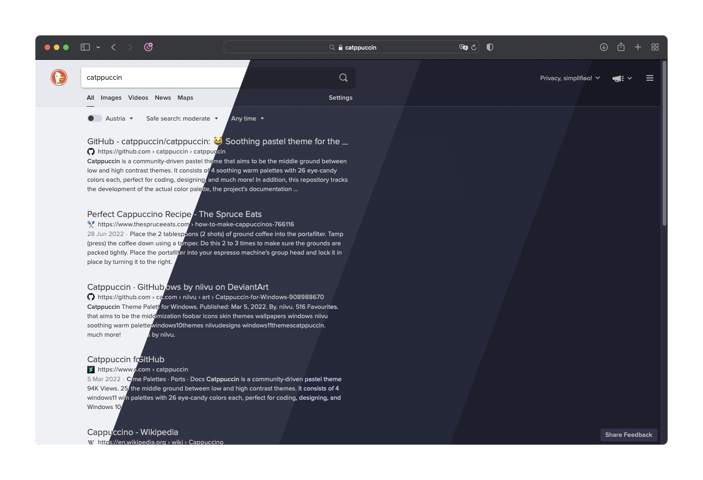

<h3 align="center">
	<br/>
	
	Catppuccin for <a href="https://duckduckgo.com">DuckDuckGo</a>
	
</h3>

<p align="center">
	<a href="https://github.com/catppuccin/duckduckgo/stargazers"></a>
	<a href="https://github.com/catppuccin/duckduckgo/issues"></a>
	<a href="https://github.com/catppuccin/duckduckgo/contributors"></a>
</p>



## Usage

### Bookmarklet:
1. Bookmark this bookmarklet, by selecting the code below and dragging it to your bookmarks bar
```js
javascript:(function()%7Bconst%20colors%3D%7Blatte%3A%7Bbase%3A%22%23eff1f5%22%2Cblue%3A%22%231e66f5%22%2Clavender%3A%22%237287fd%22%2Cmantle%3A%22%23e6e9ef%22%2Crosewater%3A%22%23dc8a78%22%2Ctext%3A%22%234c4f69%22%7D%2Cfrappe%3A%7Bbase%3A%22%23303446%22%2Cblue%3A%22%238caaee%22%2Clavender%3A%22%23babbf1%22%2Cmantle%3A%22%23292c3c%22%2Crosewater%3A%22%23f2d5cf%22%2Ctext%3A%22%23c6d0f5%22%7D%2Cmacchiato%3A%7Bbase%3A%22%2324273a%22%2Cblue%3A%22%238aadf4%22%2Clavender%3A%22%23b7bdf8%22%2Cmantle%3A%22%231e2030%22%2Crosewater%3A%22%23f4dbd6%22%2Ctext%3A%22%23cad3f5%22%7D%2Cmocha%3A%7Bbase%3A%22%231e1e2e%22%2Cblue%3A%22%2389b4fa%22%2Clavender%3A%22%23b4befe%22%2Cmantle%3A%22%23181825%22%2Crosewater%3A%22%23f5e0dc%22%2Ctext%3A%22%23cdd6f4%22%7D%7D%3Bconst%20flavour%3Dwindow.prompt(%22Choose%20a%20theme%3A%22%2C%22mocha%22)%3Bconst%20blueLinks%3Dconfirm(%22Use%20blue%20links%3F%22)%3Bconst%20ct%3Dcolors%5Bflavour%5D%3Bconst%20theme%3D%5B%6021%3D%24%7Bct.mantle%20%7D%60%2C%607%3D%24%7Bct.base%20%7D%60%2C%608%3D%24%7Bct.text%20%7D%60%2C%609%3D%24%7BblueLinks%3Fct.blue%3Act.rosewater%20%7D%60%2C%60aa%3D%24%7Bct.lavender%20%7D%60%2C%60ae%3D%24%7Bflavour%3D%3D%22latte%22%3F-1%3Act.base%20%7D%60%2C%60j%3D%24%7Bct.mantle%20%7D%60%2C%60x%3D%24%7BblueLinks%3Fct.blue%3Act.rosewater%20%7D%60%5D%3Bfor(const%20item%20of%20theme)%7Bdocument.cookie%3D%60%24%7B%20item%20%7D%3B%20max-age%3D126144000%3B%20samesite%3Dlax%3B%20secure%60%7D%7D)()%3B
```
2. Visit <https://duckduckgo.com>
3. Run the bookmarklet
4. Enter `latte`, `frappe`, `macchiato`, or `mocha` in the first dialog that appears.\
   Select "OK" in the second dialogue to use `blue` links, or cancel to use `rosewater` link colours.
   
5. Reload the page.\
   If the theme is not being applied, try reloading with <kbd>Ctrl+Shift+R</kbd> or <kbd>Cmd+Shift+R</kbd>

You can find the source for the bookmarklet in `./bookmarklet.js`.

### Script:

1. Copy [this](https://raw.githubusercontent.com/catppuccin/duckduckgo/main/bookmarklet.js) script to your clipboard
2. Visit <https://duckduckgo.com>
3. Open the devtool console (e.g. <kbd>Ctrl+Shift+K</kbd> or <kbd>Cmd+Opt+K</kbd>)
4. Paste the script there and hit <kbd>Enter</kbd> to run it
5. Enter `latte`, `frappe`, `macchiato`, or `mocha` in the first dialog that appears.\
   Select "OK" in the second dialogue to use `blue` links, or cancel to use `rosewater` link colours.
   
6. Reload the page.\
   If the theme is not being applied, try reloading with <kbd>Ctrl+Shift+R</kbd> or <kbd>Cmd+Shift+R</kbd>


## 💝 Thanks to

- [Astro](https://github.com/narutoxy)
- [esdmr](https://github.com/esdmr)
- [winston](https://github.com/nekowinston)

&nbsp;

<p align="center"></p>
<p align="center">Copyright &copy; 2021-present <a href="https://github.com/catppuccin" target="_blank">Catppuccin Org</a>
<p align="center"><a href="https://github.com/catppuccin/catppuccin/blob/main/LICENSE"></a></p>
