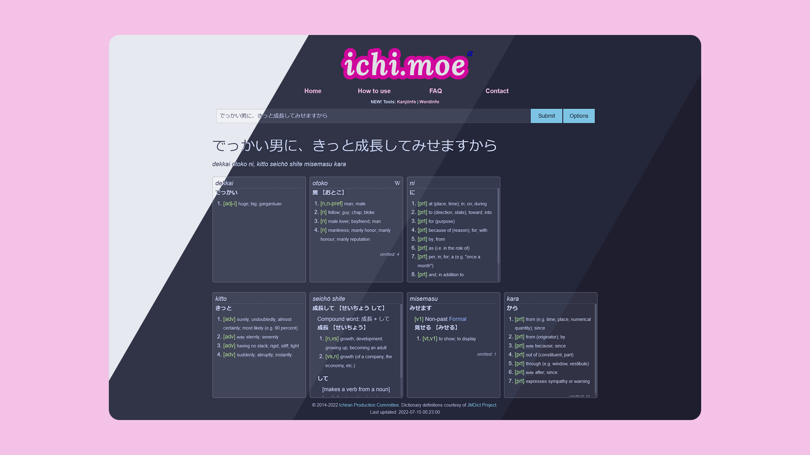

<h3 align="center">
	 
	
	Catppuccin for <a href="https://ichi.moe">ichi.moe</a>
	
</h3>

	
	
	
	

	

## Usage

#### Stylus

1. Install the Stylus [Firefox](https://addons.mozilla.org/en-GB/firefox/addon/styl-us/)/[Chrome](https://chrome.google.com/webstore/detail/stylus/clngdbkpkpeebahjckkjfobafhncgmne) extension.
2. [Click here to install.](https://github.com/catppuccin/ichi.moe/raw/main/catppuccin.user.css)

#### Stylish

1. Install the Stylish [Firefox](https://addons.mozilla.org/en-GB/firefox/addon/stylish/)/[Chrome](https://chrome.google.com/webstore/detail/stylish-custom-themes-for/fjnbnpbmkenffdnngjfgmeleoegfcffe) extension.
2. Create a new custom style that applies to `ichi.moe`.
3. Copy the contents of [catppuccin.user.css](catppuccin.user.css) and paste it on the created style.

## 💝 Thanks to

-   [Ren](https://github.com/watatomo)

&nbsp;

	

	Copyright &copy; 2021-present <a href="https://github.com/catppuccin" target="_blank">Catppuccin Org</a>

	

