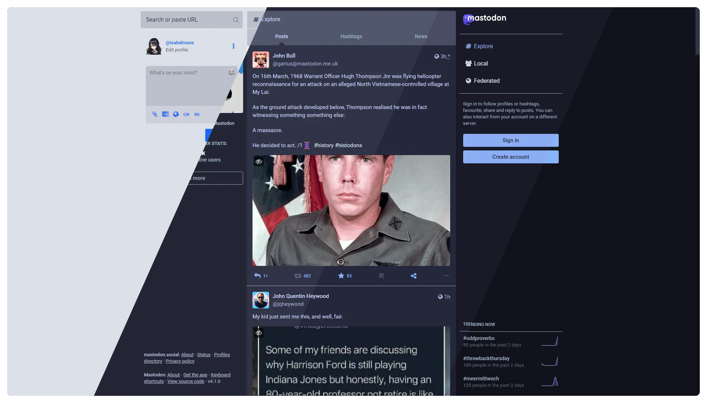
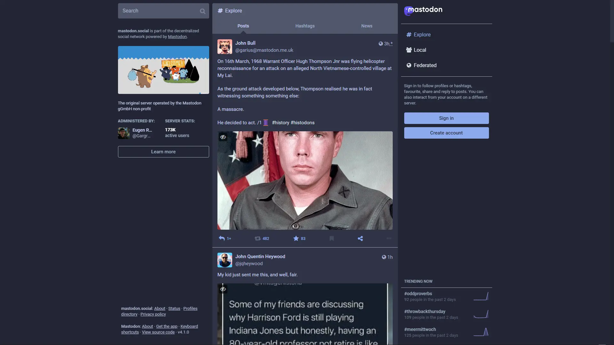
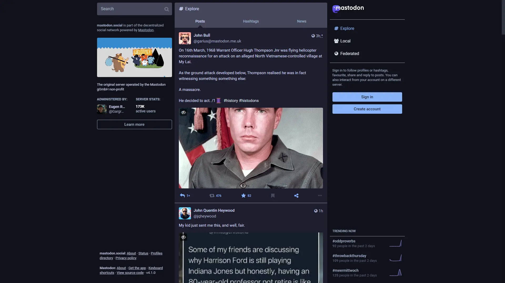

<!-- AUTOGEN:README START -->
<!-- THIS FILE IS AUTOGENERATED. DO NOT EDIT IT BY HAND -->

<h3 align="center">
	<br/>
	
  Catppuccin for <a href="https://github.com/mastodon/mastodon">Mastodon</a>
	
</h3>

<p align="center">
	<a href="https://github.com/catppuccin/userstyles/issues?q=is%3Aissue+is%3Aopen+label%3Amastodon"></a>
	<a href="https://raw.githubusercontent.com/catppuccin/userstyles/main/styles/mastodon/catppuccin.user.css"></a>
</p>

<p align="center">
  
</p>

## Previews

<details>
<summary>🌻 Latte</summary>

</details>
<details>
<summary>🪴 Frappé</summary>

</details>
<details>
<summary>🌺 Macchiato</summary>

</details>
<details>
<summary>🌿 Mocha</summary>

</details>

## Usage  
This userstyle is applied by default on a few common Mastodon server URLs, listed at the top:
```css
@-moz-document domain("mastodon.social"), domain("mstdn.social"), domain("fosstodon.org"), domain("piaille.fr"), domain("tech.lgbt") {
```
If you don't see your Mastodon server URL, feel free to add it to the list with the `domain("<URL>")` syntax.
> [!WARNING]
> On update your custom `@-moz-document domain("url")` will be removed so will have to re applied upon update. 
> Therefore we strongly encorage users to contribute to the project with their instances.


## 🙋 FAQ
- Q: **The theme does not look the same as the preview?**  
	A: Your Mastodon instance may be using its own custom CSS, which is changing the look of the theme.
- Q: **The theme is not working?**  
	A: One solution might be changing the theme to either light or dark via **Preferences** > **Appearance** > **Site theme**.


## 💝 Current Maintainer(s)
- [Isabel](https://github.com/isabelroses)

## 💖 Past Maintainer(s)
- [Andreas Grafen](https://github.com/andreasgrafen)

&nbsp;

<p align="center">
	
</p>

<p align="center">
	Copyright &copy; 2021-present <a href="https://github.com/catppuccin" target="_blank">Catppuccin Org</a>
</p>

<!-- AUTOGEN:README END -->
