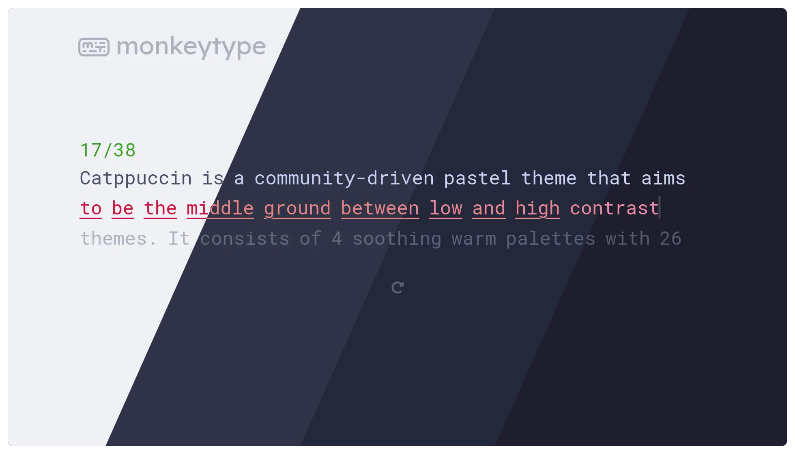
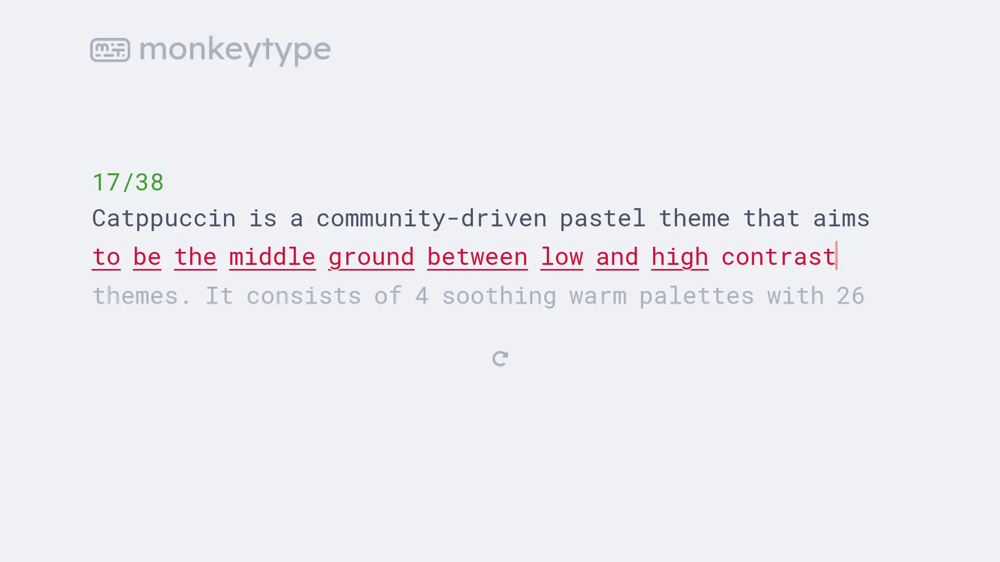
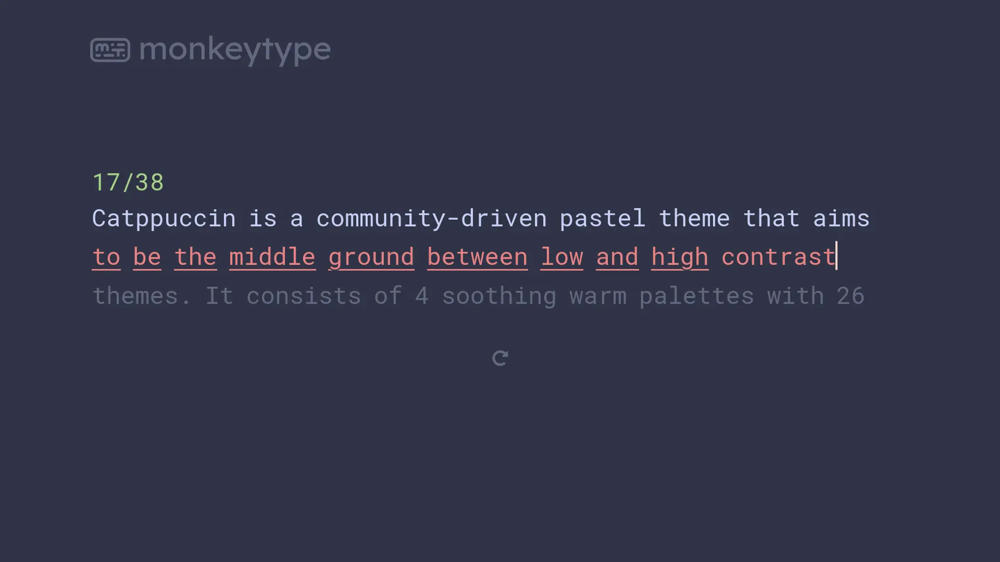
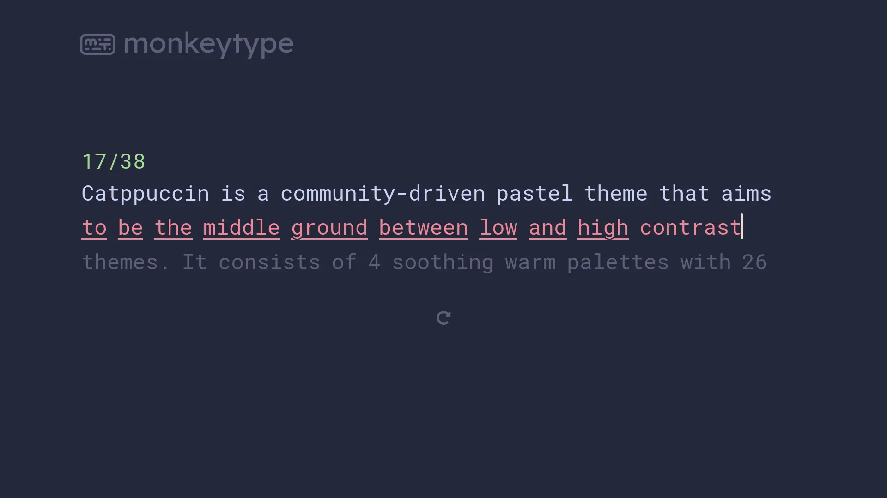
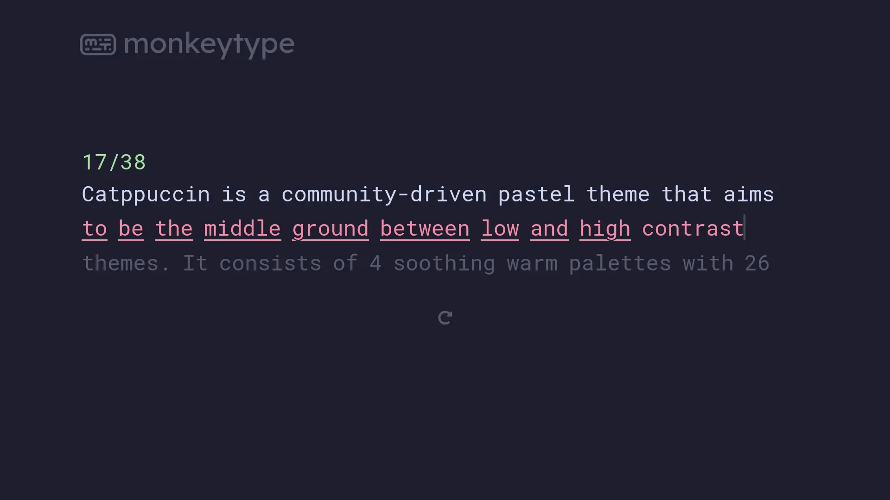

<h3 align="center">
	 
	
	Catppuccin for <a href="https://monkeytype.com">MonkeyType</a>
	
</h3>

    
    
    

  

## Previews

🌻 Latte

🪴 Frappé

🌺 Macchiato

🌿 Mocha

## Usage
1. Choose your flavour.
2. Click the link of your flavour and enjoy.
  - [🌿 Mocha](https://monkeytype.com?customTheme=WyIjMWUxZTJlIiwiI2E2ZTNhMSIsIiNmNWUwZGMiLCIjNTg1YjcwIiwiIzE4MTgyNSIsIiNjZGQ2ZjQiLCIjZjM4YmE4IiwiI2ViYTBhYyIsIiNmMzhiYTgiLCIjZWJhMGFjIl0=)
  - [🌺 Macchiato](https://monkeytype.com?customTheme=WyIjMjQyNzNhIiwiI2E2ZGE5NSIsIiNmNGRiZDYiLCIjNWI2MDc4IiwiIzFlMjAzMCIsIiNjYWQzZjUiLCIjZWQ4Nzk2IiwiI2VlOTlhMCIsIiNlZDg3OTYiLCIjZWU5OWEwIl0=)
  - [🪴 Frappe](https://monkeytype.com?customTheme=WyIjMzAzNDQ2IiwiI2E2ZDE4OSIsIiNmMmQ1Y2YiLCIjNjI2ODgwIiwiIzI5MmMzYyIsIiNjNmQwZjUiLCIjZTc4Mjg0IiwiI2VhOTk5YyIsIiNlNzgyODQiLCIjZWE5OTljIl0=)
  - [🌻 Latte](https://monkeytype.com?customTheme=WyIjZWZmMWY1IiwiIzQwYTAyYiIsIiNkYzhhNzgiLCIjYWNiMGJlIiwiI2U2ZTllZiIsIiM0YzRmNjkiLCIjZDIwZjM5IiwiI2U2NDU1MyIsIiNkMjBmMzkiLCIjZTY0NTUzIl0=)

Custom colors

  1. Open settings on [monkeytype.com](https://monkeytype.com/)
  2. Scroll down to `theme` and put the following colors in the custom theme. (this is mocha but you can put in the colors from *flavour*.css)
  <table>
    <tr>
      <td>Background</td>
      <td> #363a4f</td>
      <td>Main</td>
      <td> #a6e3a1 (Change this color to whatever you want)</td>
    </tr>
    <tr>
      <td>Caret</td>
      <td> #f5e0dc</td>
      <td>Sub</td>
      <td> #585b70</td>
    </tr>
    <tr>
      <td>Sub alt</td>
      <td> #585b70</td>
      <td>Text</td>
      <td> #cdd6f4</td>
    </tr>
    <tr>
      <td>Error</td>
      <td> #f38ba8</td>
      <td>Extra error</td>
      <td> #eba0ac</td>
    </tr>
    <tr>
      <td>colorful mode</td>
    </tr>
    <tr>
      <td>Error</td>
      <td> #f38ba8</td>
      <td>Extra error</td>
      <td> #eba0ac</td>
    </tr>
  </table>

### Or

1. Open settings on [monkeytype.com](https://monkeytype.com/) (Not yet updated to version 0.2.0)
2. Go to the theme settings
3. Select the Catppuccin theme

## 💝 Thanks to

- [Jazil T S](https://github.com/tsjazil)
- [Lexi](https://github.com/ShyyLexi/)

&nbsp;

Copyright &copy; 2021-present <a href="https://github.com/catppuccin" target="_blank">Catppuccin Org</a>

