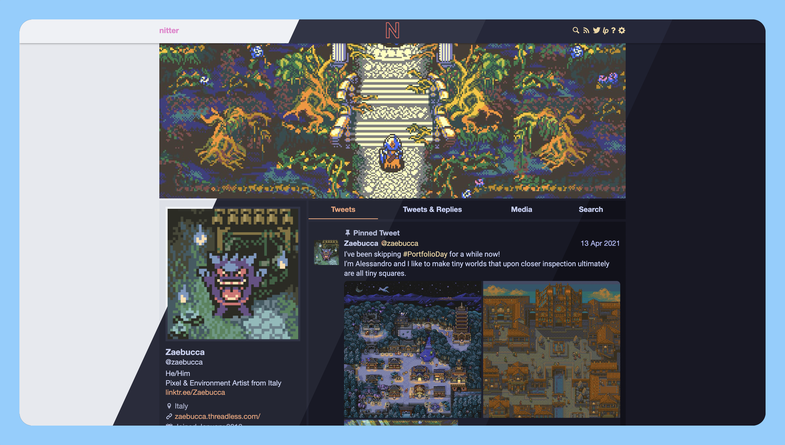

<h3 align="center">
	 
	
	Catppuccin for <a href="https://nitter.net/">Nitter</a>
	
</h3>

	
	
	

	

## Usage

1. Install Stylus extension for [Firefox](https://addons.mozilla.org/en-US/firefox/addon/styl-us/), [Chrome](https://chrome.google.com/webstore/detail/stylus/clngdbkpkpeebahjckkjfobafhncgmne) or [Opera](https://addons.opera.com/en-gb/extensions/details/stylus/)
2. Then install with Stylus (click on the link):
  - [🦚 Catppuccin for  Nitter](https://github.com/catppuccin/nitter/raw/main/src/NitterCatppuccin.user.css)
3. Choose you theme and accent color by Setting Theme in Stylus Options.

## 💝 Thanks to

- [AnubisNekhet](https://github.com/AnubisNekhet)

&nbsp;

	

	Copyright &copy; 2021-present <a href="https://github.com/catppuccin" target="_blank">Catppuccin Org</a>

	

