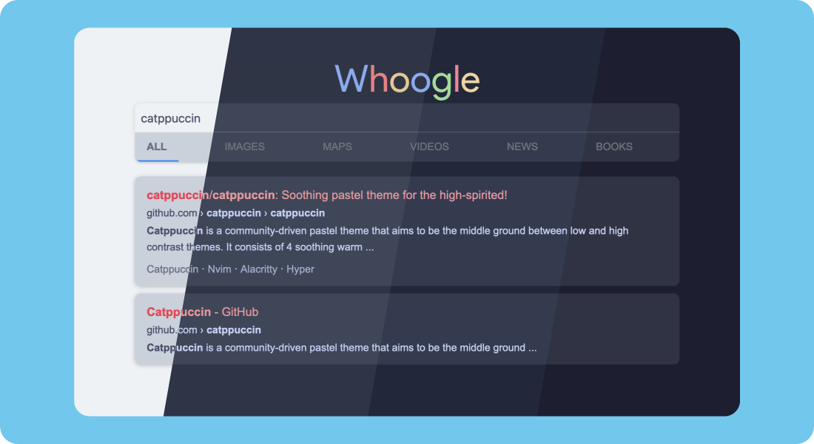

<h3 align="center">
	 
	
	Catppuccin for <a href="https://github.com/benbusby/whoogle-search">Whoogle</a>
	
</h3>

    
    
    

## Usage

### As an instance user:

1. Choose your flavour!
2. Go to Configuration and scroll to the bottom.
3. Under custom css, paste the contents of `css/<flavour>.css`
4. Hit the Apply button.

### As an instance host:

1. Choose your flavour!
2. Add the contents of `env/<flavour>.env` to either your environment variables or your `whoogle.env`.

## 💝 Thanks to

- [Sanjay Pavan](https://github.com/WitherCubes)

&nbsp;

Copyright &copy; 2021-present <a href="https://github.com/catppuccin" target="_blank">Catppuccin Org</a>

