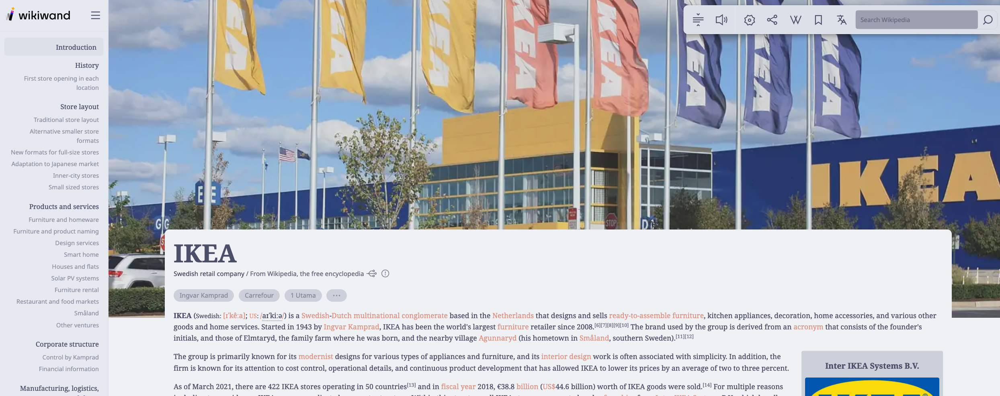
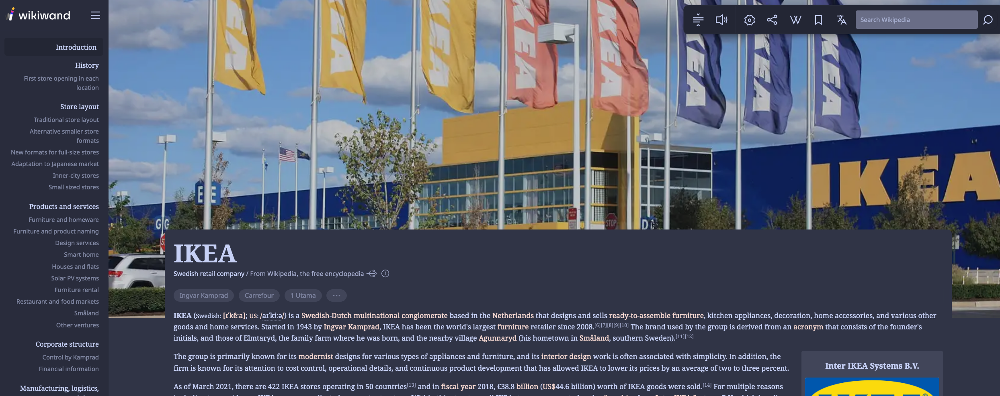
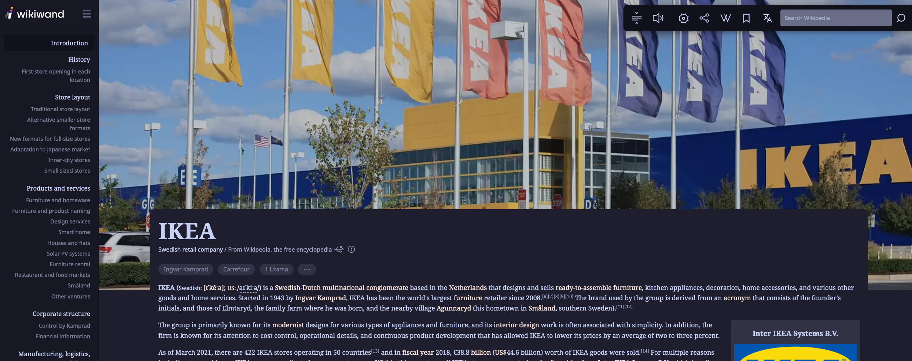

<h3 align="center">
	 
	
	Catppuccin for <a href="https://www.wikiwand.com/">Wikiwand</a>
	
</h3>

	
	
	

	

## Previews

🌻 Latte

🪴 Frappé

🌺 Macchiato

🌿 Mocha

## Usage

[🌻 Latte](https://userstyles.world/style/7272/catppuccin-latte-wikiwand)

[🪴 Frappé](https://userstyles.world/style/7271/catppuccin-frappe-wikiwand)

[🌺 Macchiato](https://userstyles.world/style/7270/catppuccin-macchiato-wikiwand)

[🌿 Mocha](https://userstyles.world/style/7269/catppuccin-mocha-wikiwand)

_You can change the accent by changing `--accent: to var(--accent_HERE)` at the bottom of `:root`_

## 💝 Thanks to

- [Tnixc](https://github.com/tnixc)

&nbsp;

	

	Copyright &copy; 2021-present <a href="https://github.com/catppuccin" target="_blank">Catppuccin Org</a>

	

