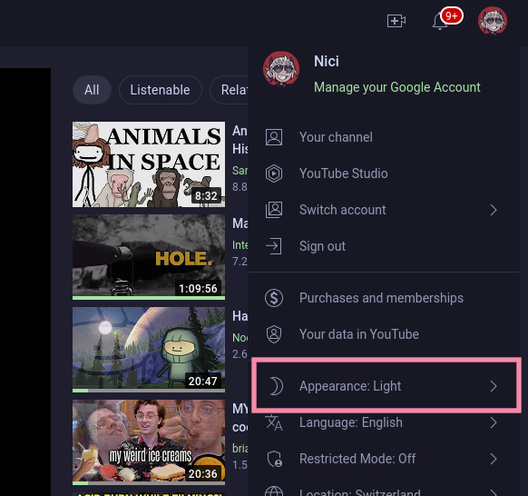

<h3 align="center">
	 
	
	Catppuccin for <a href="https://www.youtube.com">YouTube</a>
	
</h3>

    
    
    

  

## Previews

🌻 Latte

  

🪴 Frappé

  

🌺 Macchiato

  

🌿 Mocha

  

## Usage

1. Install Stylus extension for [Firefox](https://addons.mozilla.org/en-US/firefox/addon/styl-us/), [Chrome](https://chrome.google.com/webstore/detail/stylus/clngdbkpkpeebahjckkjfobafhncgmne) or [Opera](https://addons.opera.com/en-gb/extensions/details/stylus/)
2. Then install with Stylus (click on the link):
  - [🌻 Catppuccin Latte](https://github.com/catppuccin/YouTube/raw/main/src/YouTubeCatppuccinLatte.user.css)
  - [🪴 Catppuccin Frappe](https://github.com/catppuccin/YouTube/raw/main/src/YouTubeCatppuccinFrappe.user.css)
  - [🌺 Catppuccin Macchiato](https://github.com/catppuccin/YouTube/raw/main/src/YouTubeCatppuccinMacchiato.user.css)
  - [🌿 Catppuccin Mocha](https://github.com/catppuccin/YouTube/raw/main/src/YouTubeCatppuccinMocha.user.css)
3. Choose Your accent color by Setting Theme in Stylus Options

4. Make sure your base youtube theme is set to light mode

## 💝 Thanks to

- [RaitaroH](https://github.com/RaitaroH/YouTube-DeepDark) - this theme is made by modification of great YouTube-DeepDark theme by RaitaroH

&nbsp;

Copyright &copy; 2021-present <a href="https://github.com/catppuccin" target="_blank">Catppuccin Org</a>

